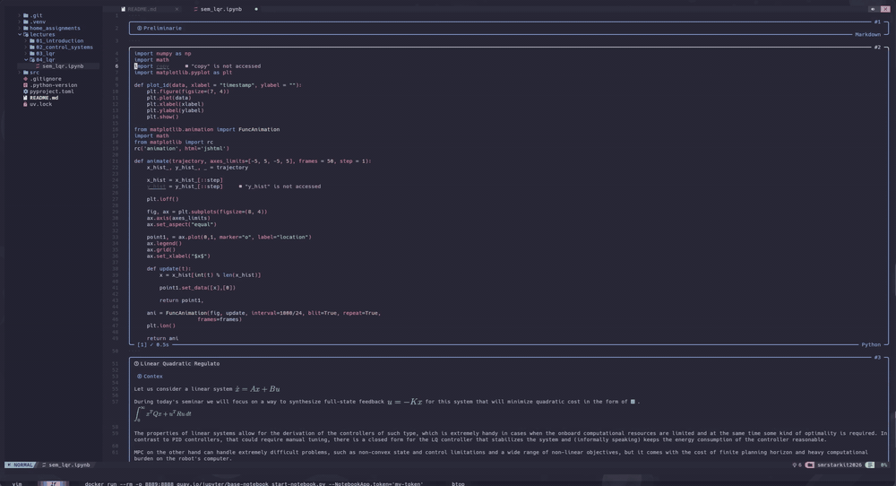

# nvjup

A Neovim-native editor for Jupyter notebooks. Open an `.ipynb` file and work with cells, Markdown, kernels, rich output, LSP, and remote Jupyter servers without converting the notebook to another format.

<p align="center">
  
</p>

## Features

- **Notebook editing** — navigate, insert, delete, move, split, merge, duplicate, and convert cells.
- **Lossless nbformat** — preserves metadata, attachments, outputs, MIME bundles, cell IDs, and unknown fields.
- **Language tooling** — per-language Tree-sitter highlighting and cross-cell LSP diagnostics, completion, navigation, rename, symbols, and code actions.
- **Kernel execution** — run one cell or a batch, stream output, answer stdin, interrupt, restart, and persist execution results.
- **Rich output** — text, tracebacks, tables, sanitized HTML, PNG, JPEG, SVG, PDF, progress bars, basic widgets, and ipympl frames.
- **Markdown and LaTeX** — rendered notebook cells through `render-markdown.nvim` and `Snacks.image`, while code cells remain code.
- **Interactive figures** — sandboxed Plotly and Bokeh rendering with an in-Neovim focus view or an optional Awrit window.
- **Remote Jupyter** — connect through an in-Neovim wizard and browse local/remote files in a two-panel Telescope UI.
- **Large notebook support** — dirty-cell highlighting/rendering, targeted output updates, bounded payloads, and coalesced event processing.

Notebook HTML and arbitrary notebook JavaScript are never executed. Existing interactive output is blocked until explicitly trusted; output produced by a local kernel receives revision-scoped ephemeral trust.

## Requirements

### Core

- Neovim **0.11+**;
- Python **3.11+**;
- [`uv`](https://docs.astral.sh/uv/);
- `ipykernel` in the selected Python environment, or a registered kernelspec for a non-Python kernel.

The install command below creates a plugin-local Python environment containing `jupyter_client`, `aiohttp`, Plotly, Bokeh, and Playwright. Kernel environments are independent: for a Python project, install `ipykernel` in the project's `.venv` or `venv`.

### Optional integrations

| Feature | Dependency |
|---|---|
| syntax highlighting | `nvim-treesitter` and parsers for the notebook languages |
| completion UI and live-kernel completion | `nvim-cmp` |
| outline/variable Telescope pickers; remote files | `telescope.nvim` (required for remote files) |
| rendered Markdown | `render-markdown.nvim` plus Markdown parsers |
| LaTeX and image integration | `snacks.nvim`, `pdflatex`, ImageMagick |
| terminal images | Kitty or Ghostty; `chafa` is the fallback |
| SVG conversion | `rsvg-convert` |
| interactive figures | Chromium |
| external interactive window | [Awrit](https://github.com/chase/awrit) and Kitty remote control |
| Python LSP defaults | `pyright-langserver` and `ruff` |

Missing optional dependencies degrade to simpler output rather than preventing notebook editing.

## Installation

### lazy.nvim

```lua
{
  "LumbaBalumba/nvjup",
  lazy = false, -- nvjup must register BufReadCmd before an .ipynb is opened
  build = "uv sync --frozen",
  dependencies = {
    "nvim-treesitter/nvim-treesitter",

    -- Optional, remove integrations you do not use.
    "hrsh7th/nvim-cmp",
    "nvim-telescope/telescope.nvim",
    "MeanderingProgrammer/render-markdown.nvim",
    "folke/snacks.nvim",
  },
  opts = {},
}
```

Install Chromium separately if interactive Plotly/Bokeh output is needed. nvjup uses a system `chromium`, `chromium-browser`, or Google Chrome executable when available; set `NVJUP_CHROMIUM` for a custom path.

### Native packages

```bash
git clone https://github.com/LumbaBalumba/nvjup \
  "${XDG_DATA_HOME:-$HOME/.local/share}/nvim/site/pack/nvjup/start/nvjup"

cd "${XDG_DATA_HOME:-$HOME/.local/share}/nvim/site/pack/nvjup/start/nvjup"
uv sync --frozen
```

Then add this to `init.lua`:

```lua
require("nvjup").setup({})
```

Run `:checkhealth nvjup` after installation.

## Quick start

```vim
:edit notebook.ipynb
```

Common mappings:

| Mapping | Action |
|---|---|
| `]c` / `[c` | next / previous cell |
| `]C` / `[C` | next / previous code cell |
| `<leader>na` / `<leader>nb` | insert a cell above / below |
| `<leader>nd` | delete cell |
| `<leader>nk` / `<leader>nj` | move cell up / down |
| `<leader>nt` | cycle code → Markdown → raw |
| `<leader>nz` | toggle rendered Markdown/source |
| `<C-CR>` | run current cell |
| `<S-CR>` | run current cell and advance |
| `<leader>nR` | run all code cells |
| `<leader>ni` / `<leader>nx` | interrupt / restart kernel |
| `<leader>np` | open full output |
| `<leader>nf` / `<leader>nF` | interactive TUI / Awrit focus |
| `<leader>nv` | inspect kernel variables |
| `<leader>nK` | connect to a remote Jupyter server |
| `<leader>ne` | local/remote file manager |

Normal LSP mappings such as `gd`, `gr`, `K`, `<leader>ra`, and `<leader>ca` work across code cells. All mappings are buffer-local and configurable.

See `:help nvjup-navigation`, `:help nvjup-commands`, and `:help nvjup-setup` for the complete list.

## Configuration

The defaults work without calling `setup`. A typical configuration only changes a few options:

```lua
require("nvjup").setup({
  render = {
    max_output_lines = 16,
    images = {
      backend = "auto", -- auto, kitty, chafa, or text
      max_width = 72,
      max_height = 28,
    },
  },

  execution = {
    clear_before_run = true,
    repeat_policy = "queue", -- queue, cancel, or replace
    stop_on_error = true,
    trust_local_kernel = true,
  },

  completion = {
    kernel = false, -- optional lower-priority live-kernel cmp source
  },

  lsp = {
    auto_start = true,
    -- Python uses Pyright and Ruff when they are available.
    -- Supply lsp.servers to replace the defaults.
  },
})
```

Python kernels use `kernel.python_path` when set, then an `ipykernel`-capable project `.venv` or `venv`, `kernel.system_python`, and finally a system Python. Non-Python notebooks use their registered kernelspec. The Python running nvjup's sidecar is selected separately.

For a remote server, the simplest setup is interactive:

```vim
:NvJupRemoteConnect
```

The wizard asks for the URL, hidden token, TLS/origin policy, and kernelspec. Credentials remain in Neovim memory. Static remote configuration is also available under `kernel.remote`; see `:help nvjup-stage7`.

All defaults and advanced limits are documented in `:help nvjup-setup`.

## Output and trust

- HTML is sanitized and rendered as terminal text/tables; it is not executed.
- SVG, images, text, RPC messages, filesystem transfers, renderer queues, and Chromium frames have configurable bounds.
- Loaded Plotly/Bokeh output requires `:NvJupTrustInteractive`.
- `:NvJupTrustRevoke` removes persisted trust.
- Editing a cell invalidates revision-scoped local execution trust.
- Remote kernel output never receives automatic local trust.

See [`docs/spec/trust.md`](docs/spec/trust.md) for the complete model.

## Documentation

- `:help nvjup` — user guide, mappings, commands, and options;
- `:checkhealth nvjup` — dependency and integration diagnostics;
- [`docs/spec/README.md`](docs/spec/README.md) — format, protocol, state-machine, and trust contracts;
- [`docs/stage6.md`](docs/stage6.md) — interactive renderer and sandbox;
- [`docs/stage7.md`](docs/stage7.md) — live tooling and remote kernels;
- [`docs/stage8.md`](docs/stage8.md) — remote file manager.

## Development

```bash
./scripts/test
docker compose run --build --rm test
```

Tests use isolated XDG directories and do not load or modify the user's Neovim configuration.
